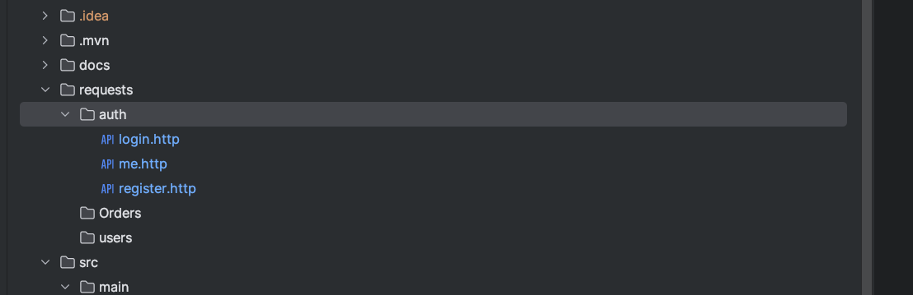
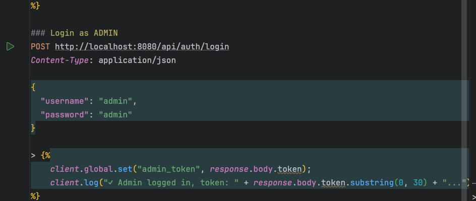

# RestOrders - Order Management Microservice

Microservice for order management with JWT authentication and role-based authorization.

## Quick Start

```bash
docker-compose up --build
```

Application: http://localhost:8080

## API Documentation (Swagger)

**Swagger UI:** http://localhost:8080/swagger-ui.html

Interactive API documentation with ability to test endpoints directly in browser.

**How to use:**
1. Open http://localhost:8080/swagger-ui.html
2. Register user via `POST /api/auth/register` or login with admin (`admin`/`admin`)
3. Copy JWT token from response
4. Click "Authorize" button (top right)
5. Enter token and click "Authorize"
6. Test any endpoint

**OpenAPI JSON:** http://localhost:8080/v3/api-docs

## Testing

### Automated Workflow Test

**File:** `requests/workflow-test.http`

Runs complete workflow: Register → Login → Create Order → Get Orders → Delete Order

Execute in IntelliJ IDEA / VS Code with REST Client extension to run all tests at once.

### Manual Testing
1. Fast test endpoints -> requests/
2. For testing users endpoints, you need firstly login by admin 